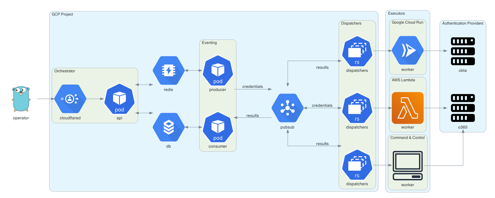

# trident

[](https://github.com/praetorian-inc/trident/actions?query=branch%3Adevelopment)
[](https://github.com/praetorian-inc/trident/releases)
[](https://gcr.io/praetorian-red-team-public)

The Trident project is an automated password spraying tool developed to meet the
following requirements:

* the ability to be deployed on several cloud platforms/execution providers

* the ability to schedule spraying campaigns in accordance with a target’s
  account lockout policy

* the ability to increase the IP pool that authentication attempts originate
  from for operational security purposes

* the ability to quickly extend functionality to include newly-encountered
  authentication platforms

## Table of Contents

   * [trident](#trident)
   * [Table of Contents](#table-of-contents)
   * [Architecture](#architecture)
   * [Deployment](#deployment)
   * [Installation](#installation)
   * [Usage](#usage)
      * [Config](#config)
      * [Campaigns](#campaigns)
      * [Results](#results)

## Architecture



> This diagram was generated using [Diagrams](https://diagrams.mingrammer.com).
> The Go gopher was designed by [Renee French](http://reneefrench.blogspot.com/)
> and is licensed under [CC BY 3.0](https://creativecommons.org/licenses/by/3.0).

## Deployment

Deploying trident requires a Google Cloud project, a domain name (for the orchestrator
API), and a Cloudflare Access configuration for this domain. Cloudflare Access is
used to authenticate requests to the orchestrator API.

```bash
cd terraform
terraform init
terraform plan
terraform apply
```

## Installation

Trident has a command line interface available in the
[releases](https://github.com/praetorian-inc/trident/releases) page.
Alternatively, you can download and install `trident-client` via `go get`:

```
go get github.com/praetorian-inc/trident/cmd/trident-client
```

## Usage

### Config

The `trident-client` binary sends API requests to the orchestrator. It reads
from `~/.trident/config.yaml`, which has the following format:

```yaml
orchestrator-url: https://trident.example.org
providers:
  okta:
    domain: target-subdomain
```

### Campaigns

With a valid `config.yaml`, the `trident-client` can be used to create password
spraying campaigns, as shown below:

```
trident-client campaign -u usernames.txt -p passwords.txt --interval 5s --window 120s
```

The `--interval` option allows the operator to insert delays between credential
attempts. The `--window` option allows the operator to set a hard stop time for
the campaign. Additional arguments are documented below:

```
Usage:
  trident-cli campaign [flags]

Flags:
  -a, --auth-provider string   this is the authentication platform you are attacking (default "okta")
  -h, --help                   help for campaign
  -i, --interval duration      requests will happen with this interval between them (default 1s)
  -b, --notbefore string       requests will not start before this time (default "2020-09-09T22:31:38.643959-05:00")
  -p, --passfile string        file of passwords (newline separated)
  -u, --userfile string        file of usernames (newline separated)
  -w, --window duration        a duration that this campaign will be active (ex: 4w) (default 672h0m0s)
```

### Results

The `results` subcommand can be used to query the result table. This subcommand
has several options, but defaults to showing all valid credentials across all
campaigns.

```
$ trident-client results
+----+-------------------+------------+-------+
| ID | USERNAME          | PASSWORD   | VALID |
+----+-------------------+------------+-------+
|  1 | alice@example.org | Password1! | true  |
|  2 | bob@example.org   | Password2! | true  |
|  3 | eve@example.org   | Password3! | true  |
+----+-------------------+------------+-------+
```

Additional arguments are documented below:

```
Usage:
  trident-cli results [flags]

Flags:
  -f, --filter string          filter on db results (specified in JSON) (default '{"valid":true}')
  -h, --help                   help for results
  -o, --output-format string   output format (table, csv, json) (default "table")
  -r, --return string          the list of fields you would like to see from the results (comma-separated string) (default "*")
```

